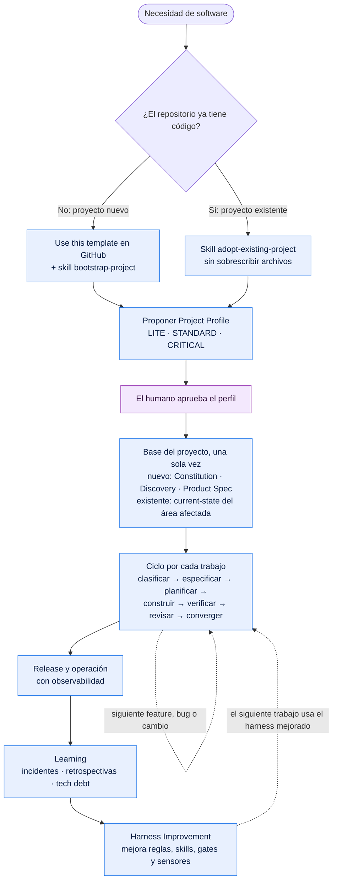
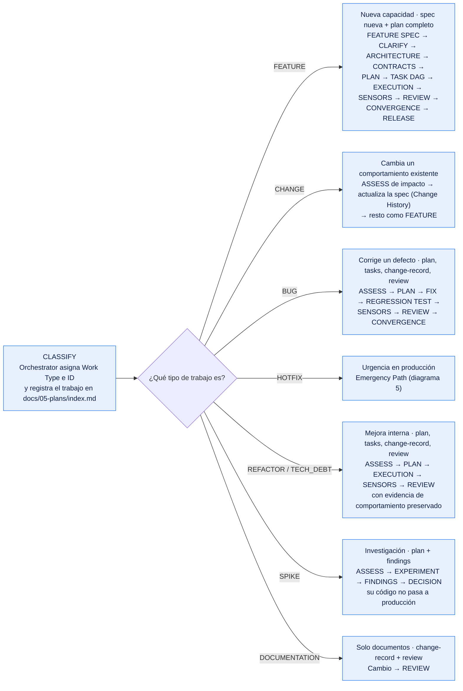
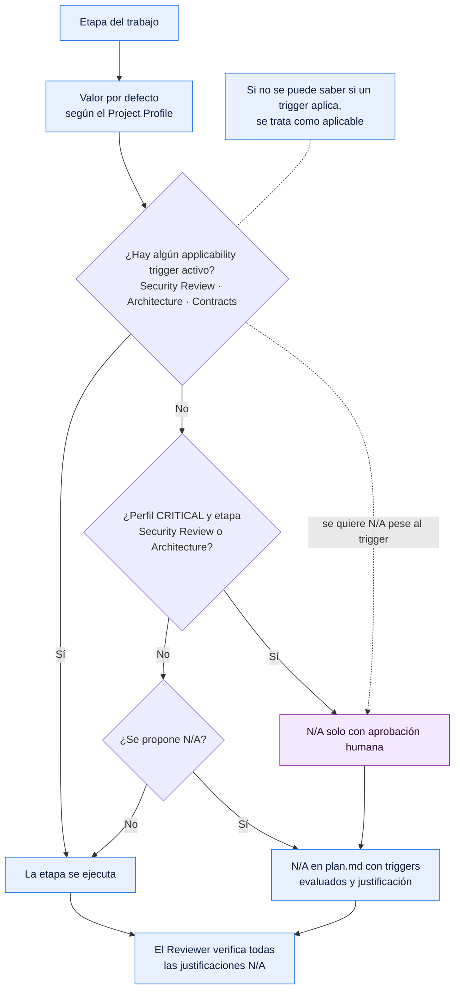
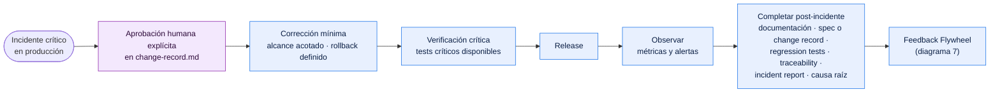
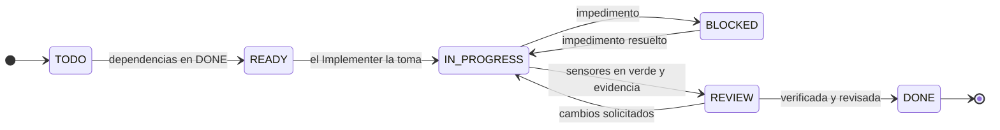
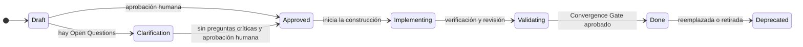
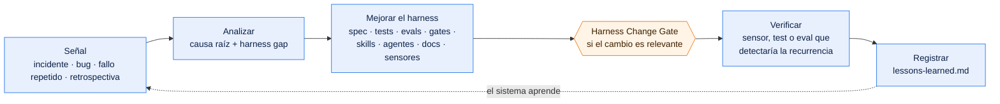

# Process Flow

Vista gráfica del proceso de desarrollo con la plantilla **Agentic SDLC basado en SDD**, pensada para presentarla y compartirla. Es un resumen visual: las reglas completas viven en [README.md](README.md#lifecycle), [work-types.md](docs/00-governance/work-types.md) y [quality-gates.md](docs/00-governance/quality-gates.md). Los términos se explican en [GLOSSARY.md](GLOSSARY.md).

## How to Read the Diagrams

| Shape / Color | Meaning |
|---|---|
| Rectángulo azul | Etapa del lifecycle, con su rol responsable y su artefacto principal |
| Hexágono naranja | Quality Gate: punto de control que debe aprobarse para avanzar |
| Rectángulo morado | Aprobación humana ([Human Approval Rules](docs/00-governance/constitution.md#human-approval-rules)) |
| Rombo | Decisión del flujo |
| Línea punteada | Retorno o ciclo de mejora |

Ninguna etapa se omite en silencio: si no aplica a un trabajo, se marca `N/A` con justificación ([Lifecycle Applicability](docs/00-governance/work-types.md#lifecycle-applicability)).

## 1. Big Picture

Del inicio del proyecto al ciclo continuo de trabajo y mejora.

## 2. Full Lifecycle

Las 20 etapas canónicas con su rol, su artefacto y su gate. La columna 1 se recorre normalmente una vez por proyecto; desde FEATURE SPEC, una vez por cada trabajo, según su Work Type.

```mermaid
flowchart TD
    subgraph P1["1 · Intención y contexto"]
        IDEA["IDEA<br/>Human<br/>problema o solicitud"] --> CLASSIFY["CLASSIFY<br/>Orchestrator<br/>Work Type · ID · applicability"]
        CLASSIFY --> ASSESS["ASSESS<br/>Analyst<br/>current-state · constraints"]
        ASSESS --> G1{{"Assessment Gate"}}
        G1 --> CONST["CONSTITUTION<br/>Human + Orchestrator<br/>reglas obligatorias"]
        CONST --> G2{{"Governance Gate"}}
        G2 --> DISC["DISCOVERY<br/>Analyst<br/>docs/01-discovery"]
        DISC --> G3{{"Discovery Gate"}}
        G3 --> PSPEC["PRODUCT SPEC<br/>Analyst<br/>docs/02-product"]
        PSPEC --> G4{{"Product Gate"}}
    end

    subgraph P2["2 · Especificación y diseño"]
        FSPEC["FEATURE SPEC<br/>Analyst<br/>spec · FR · AC · examples"] --> CLAR["CLARIFY<br/>Analyst + Human<br/>Open Questions"]
        CLAR --> QQ{"¿Quedan preguntas críticas?"}
        QQ -- "Sí" --> CLAR
        QQ -- "No" --> HSPEC["El humano aprueba la spec<br/>Approved by · Date"]
        HSPEC --> G5{{"Spec Gate"}}
        G5 --> ARCH["ARCHITECTURE<br/>Architect<br/>docs/04-architecture · ADR"]
        ARCH --> G6{{"Architecture Gate"}}
        G6 --> CONTR["CONTRACTS<br/>Architect<br/>contracts/ de la spec"]
        CONTR --> G7{{"Contract Gate"}}
    end

    subgraph P3["3 · Planificación"]
        PLAN["IMPLEMENTATION PLAN<br/>Orchestrator + Architect<br/>plan.md · risks.md"] --> G8{{"Plan Gate"}}
        G8 --> DAG["TASK DAG<br/>Orchestrator<br/>tasks.md · dependencies.md"]
        DAG --> G9{{"Implementation Gate"}}
    end

    subgraph P4["4 · Construcción y verificación"]
        EXEC["AGENT EXECUTION<br/>Implementer + Tester<br/>código · tests · progress.md"] --> SENS["FEEDBACK SENSORS<br/>Tester<br/>linter · tests · scanning · evals"]
        SENS --> G10{{"Verification Gate"}}
        G10 -. "falla un sensor bloqueante" .-> EXEC
        G10 --> REV["REVIEW<br/>Reviewer + Security<br/>review.md"]
        REV --> G11{{"Review Gate"}}
        G11 -. "BLOCKER o HIGH abiertos" .-> EXEC
        G11 --> CONV["CONVERGENCE<br/>Orchestrator<br/>traceability.md"]
        CONV --> G12{{"Convergence Gate"}}
        G12 -. "divergencia: definir la intención válida" .-> EXEC
    end

    subgraph P5["5 · Producción y aprendizaje"]
        RELEASE["RELEASE<br/>Human<br/>deployment · rollback"] --> HREL["El humano aprueba el release"]
        HREL --> G13{{"Release Gate"}}
        G13 --> OBS["OBSERVABILITY<br/>Human / Operations<br/>observability · slo · runbook"]
        OBS --> G14{{"Production Ready Gate"}}
        G14 --> LEARN["LEARNING<br/>Orchestrator + Human<br/>docs/08-learning"]
        LEARN --> HI["HARNESS IMPROVEMENT<br/>Human<br/>agents · skills · gates · evals"]
        HI --> HHAR["El humano aprueba el cambio al harness"]
        HHAR --> G15{{"Harness Change Gate"}}
    end

    G4 --> FSPEC
    G7 --> PLAN
    G9 --> EXEC
    G12 --> RELEASE
    G15 -. "siguiente trabajo" .-> CLASSIFY

    classDef stage fill:#E8F0FE,stroke:#1A73E8,color:#0B1F44
    classDef gate fill:#FFF4E5,stroke:#E8710A,color:#3D1F00
    classDef human fill:#F3E8FD,stroke:#8E24AA,color:#2E0B3A
    class IDEA,CLASSIFY,ASSESS,CONST,DISC,PSPEC,FSPEC,CLAR,ARCH,CONTR,PLAN,DAG,EXEC,SENS,REV,CONV,RELEASE,OBS,LEARN,HI stage
    class G1,G2,G3,G4,G5,G6,G7,G8,G9,G10,G11,G12,G13,G14,G15 gate
    class HSPEC,HREL,HHAR human
```

## 3. Work Type Routing

En CLASSIFY, el Orchestrator asigna el Work Type; cada tipo recorre solo las etapas y crea solo los artefactos que necesita ([Artifacts by Work Type](docs/00-governance/work-types.md#artifacts-by-work-type)).

## 4. Lifecycle Applicability

Cómo se decide, en CLASSIFY, si una etapa se ejecuta o se marca `N/A` ([Applicability Triggers](docs/00-governance/work-types.md#applicability-triggers)).

## 5. Emergency Path

Solo para `HOTFIX` ante un incidente crítico; no puede usarse para evitar el proceso normal ([Emergency Change Procedure](docs/00-governance/work-types.md#emergency-change-procedure)).

## 6. Task and Spec States

Estados de una tarea en `tasks.md`. El Implementer solo toma tareas `READY`.

Estados de una spec en `spec.md`. Solo un humano la pasa a `Approved`.

## 7. Feedback Flywheel

Cada incidente o fallo repetido mejora el sistema que produce software, no solo el código ([Feedback Flywheel](docs/08-learning/README.md)).

## 8. Roles at a Glance

| Role | Stages | Main Artifacts |
|---|---|---|
| Human | IDEA, CONSTITUTION, RELEASE, OBSERVABILITY, HARNESS IMPROVEMENT y todas las aprobaciones | Decisiones registradas en el repositorio |
| [Orchestrator](agents/orchestrator.md) | CLASSIFY, IMPLEMENTATION PLAN, TASK DAG, CONVERGENCE, LEARNING | `docs/05-plans/index.md`, `plan.md`, `tasks.md`, `progress.md` |
| [Analyst](agents/analyst.md) | ASSESS, DISCOVERY, PRODUCT SPEC, FEATURE SPEC, CLARIFY | `docs/01-discovery/`, `docs/02-product/`, spec |
| [Architect](agents/architect.md) | ARCHITECTURE, CONTRACTS, IMPLEMENTATION PLAN | `docs/04-architecture/`, ADR, `contracts/` |
| [Implementer](agents/implementer.md) | AGENT EXECUTION | Código y tests |
| [Tester](agents/tester.md) | AGENT EXECUTION, FEEDBACK SENSORS | Tests, evals, `traceability.md` |
| [Reviewer](agents/reviewer.md) | REVIEW | `review.md` |
| [Security](agents/security.md) | REVIEW, cuando aplica Security Review | Hallazgos de seguridad en `review.md` |
